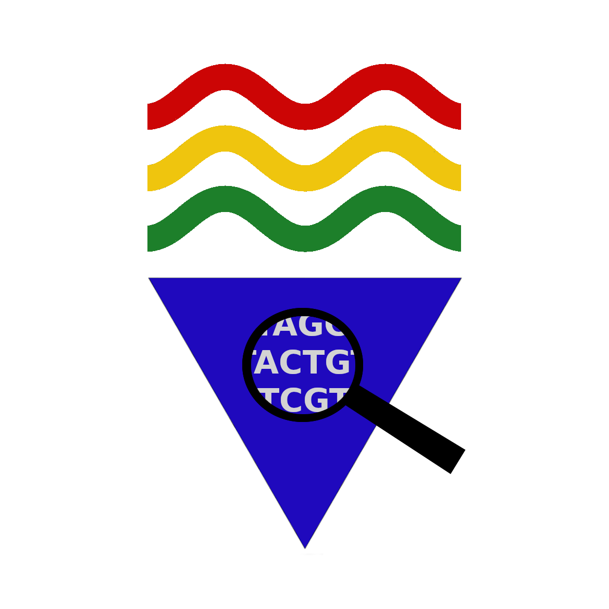

<b>Water Monitor</b>

## Code
The code is divided in three folders:
<ul>
  <li>FALCON-meta</li>
  <li>GOTTCHA2</li>
  <li>Circos</li>
</ul>

## Example of use
Example of use

<ul>
<li>
The following steps should be done to analyze your samples:<li>
<li>1-	Create a profile account at KBase (https://www.kbase.us/) online platform to run the GOTTCHA2 software. The workflow to run GOTTCHA2 for the simulated database from MOSCA can be executed at https://narrative.kbase.us/narrative/128450.<li>
<li>2-	Install the FALCON-meta algorithm (https://github.com/cobilab/falcon) using ANACONDA (https://www.anaconda.com/, available for all operating system platforms). In Windows the linux subsystem should be installed. All software is open source.<li>
<li>3-	Run the samples in GOTTCHA2 and FALCON-meta and save the results. FALCON-meta command should be: 
“./FALCON -v -F -t 15 -l 47 -x output_file.txt transcriptome_example.fasta your_reference_database.fasta”<li>
<li>4-	Run the R script (MERGE_TABLES_GOTTCHA2-FALCON_script.R) from https://github.com/waterpt/watermonitor to merge the results from both datasets. (R software package should be installed from https://www.r-project.org/)<li>
<li>5-	Run the CIRCOS script to generate the graphic representation of the detected pathogenetic strains.<li>

## ISSUES
Please let us know if there is any
[issues](https://github.com/waterpt/watermonitor/issues).

## LICENSE

License is GPLv3. 
For more information:
<pre>http://www.gnu.org/licenses/gpl-3.0.html</pre>
